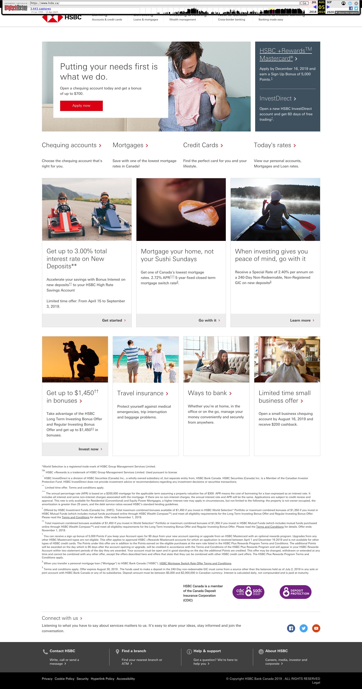

# HSBC.ca Website Redesign – Archived Project (2018–2019)

**Project Role**: Digital Project Manager  
**Organization**: HSBC Canada  
**Tools Used**: TeamSite, HTML, CSS, JavaScript, XML  
**Archived Link**: [View on Wayback Machine (Aug 5, 2019)](https://web.archive.org/web/20190805055759/https://www.hsbc.ca/)

---

## 📌 Executive Summary
As the Digital Project Manager, I led the redesign and successful deployment of HSBC.ca, HSBC Canada’s public-facing website. This major initiative enhanced digital banking experience, improved content delivery across lines of business, and ensured compliance with accessibility and performance standards. The project involved full website redevelopment, cross-functional collaboration, and strategic oversight.

---

## 🎯 Project Highlights
- Delivered full end-to-end redesign of HSBC.ca with responsive design.
- Led cross-functional teams including developers, designers, testers, and business stakeholders.
- Managed development lifecycle using TeamSite CMS with HTML, CSS, JavaScript, and XML.
- Conducted risk management, stakeholder engagement, and change approvals.
- Ensured zero-downtime go-live and seamless content migration.

---

## 🔍 Before and After Comparison

- **Before Redesign** – [HSBC.ca (2018)](https://web.archive.org/web/20180301014954/http://www.hsbc.ca/1/2/personal)  
- **After Redesign** – [HSBC.ca (2019)](https://web.archive.org/web/20190805055759/https://www.hsbc.ca/)

---

## 🧠 Key Takeaways
- Stakeholder alignment and phased rollouts were critical to success.
- Strong governance and QA practices minimized risks and ensured stability.
- Large-scale web migration requires meticulous planning across content, dev, and infra.

---

## 📚 Learnings
- Honed skills in leading complex digital transformations in a regulated environment.
- Developed deep working knowledge of CMS platforms like TeamSite.
- Gained valuable experience balancing compliance, design, and user needs.

---

## 🖼️ Screenshots (Optional)

> Add screenshots from the Wayback Machine to visually show your work.
> You can upload `.png` images in the repo and embed them here.

```markdown

```

---

## 📎 Archived Site Access

- [Main Site – August 2019 Snapshot](https://web.archive.org/web/20190805055759/https://www.hsbc.ca/)
- [Original HSBC Homepage – March 2018](https://web.archive.org/web/20180301014954/http://www.hsbc.ca/1/2/personal)

---

## 📩 Contact

**Author**: Herman Hui  
**Role**: Digital Project Manager (2016–2022)  
**LinkedIn**: [linkedin.com/in/huiherman](https://www.linkedin.com/in/huiherman)  
**Portfolio**: [huiherman.github.io](https://huiherman.github.io) *(optional)*
